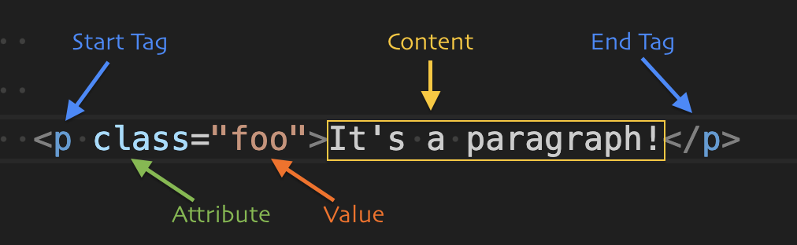

# HTML

Hypertext markup Language (Auszeichnungssprache für Hypertext)
1990 vom Web-Gründer Tim Berners-Lee, Basis SGML (Metasprache, ab 1960, Texte standardisieren und für Computer lesbar machen)

*Sprache, die den Aufbau einer Webseite beschreibt.
Hyper* wird hier im Sinne von „erweitert“ genutzt. Erweitert, weil es nicht wie eine Zeitung geradlinig ist, sondern durch sog. Links direkte Absprungmarken zu weiteren Inhalten haben kann.

“Im Webdesign wird versucht, [Seitenstrukturierung](https://wiki.selfhtml.org/wiki/HTML/Tutorials/Seitenstrukturierung) und [Textstrukturierung](https://wiki.selfhtml.org/wiki/HTML/Tutorials/Textstrukturierung)
 **nach semantischen Gesichtspunkten** zu organisieren.”

“Unter **Semantik** versteht man im Allgemeinen die Bedeutungslehre, die die Bedeutung von Zeichen wie Wörter, Phrasen oder Symbole untersucht. Durch semantisch korrektes HTML verleiht man Inhalten eine Bedeutung.”

[HTML/Tutorials/Entstehung und Entwicklung](https://wiki.selfhtml.org/wiki/HTML/Tutorials/Entstehung_und_Entwicklung)

## Einleitung

**HTML Element**
Komponente einer HTML Seite.

Sie werden meist eingeleitet mit einem startetenden Tag und enden mit einem schließenden Tag.

Ding innerhalb des öffnenden und schließenden Tags ist der Inhalt (Content).

Attribute dienen dazu dem Element weitere speziellere Eigenschaften zu geben.

[HTML/Tutorials/Element, Tag und Attribut](https://wiki.selfhtml.org/wiki/HTML/Tutorials/Element,_Tag_und_Attribut)

[HTML/Elemente](https://wiki.selfhtml.org/wiki/HTML/Elemente)

[HTML Elements](https://www.tutorialrepublic.com/html-tutorial/html-elements.php)

### Nötige Elemente (Pflicht)

`html head body` sind Pflicht – Fehlen diese, werden sie vom Browser ergänzt

Empfehlung ist, auch optionale Elemente anzugeben, damit keine Verwirrung entstehen.

## Tutorials

[HTML/Tutorials/Einstieg](https://wiki.selfhtml.org/wiki/HTML/Tutorials/Einstieg)

[HTML Tutorial](https://www.w3schools.com/html/)

**Mimo App fürs Handy**

## Semantisches Web

Eine Webseite lässt sich mit beliebigen Elementen erstellen. Sie sind in der Drstellung anpassbar und können wie Zitate, Fließtexte, Listen oder Überschriften wirken, um nur wenige Bsp. zu nennen.

Wenn man nur mit Elementen arbeitet wie z.B. `` oder `

` dann geht allerdings die Bedeutung verloren. Das heißt, wenn jemand zum Bsp. nicht sehen kann, was auf der Seite ist, sondern sich die Seite vorlesen lassen muss, dann kann er nicht feststellen, ob der Inhalt gerade ein Fließtext ist oder vielleicht eine Aufzählung. Oder er kann nicht erkennen, ob es eine Überschrift ist oder sich um eine Navigation handelt. Hier geht also auch um **Accessibility (Zugänglichkeit)**.

Außerdem hat es zudem auch Auswirkung darauf, wie Suchmaschinen (Google) mit den gescannten Seiten umgeht, bewertet und entsprechend bei Google dargestellt wird.

Zum testen der Accessibility: Chrome Lighthouse Audits
